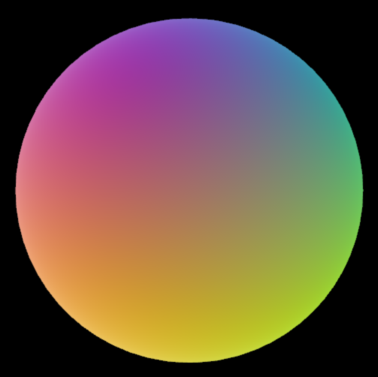

# Generate Spherical Harmonics from Cubemaps 

Example usage:
```bash
cargo run --release "example_cube.png"
```

Example output:
```rust
[
    Vec3(0.22220466, 0.21898817, 0.14254881),
    Vec3(-0.03492773, -0.035523742, -0.04413108),
    Vec3(0.08467291, 0.084554926, 0.08245803),
    Vec3(-0.12536469, 0.116683625, -0.0015117931),
    Vec3(-0.0005974173, 0.0004997501, -1.3052541e-5),
    Vec3(0.0003315853, 0.0003355989, 0.00033386963),
    Vec3(-0.014095903, -0.013458746, -0.00035665638),
    Vec3(-0.0008341355, 0.0007637911, 1.6174421e-5),
    Vec3(0.0036989318, 0.0017153315, -0.033496294),
]
```



Example wgsl shader (used for render above)
```glsl
struct FragmentInput {
    [[builtin(front_facing)]] is_front: bool;
    [[builtin(position)]] frag_coord: vec4<f32>;
    [[location(0)]] world_position: vec4<f32>;
    [[location(1)]] world_normal: vec3<f32>;
    [[location(2)]] uv: vec2<f32>;
};

fn irradianceSH(n: vec3<f32>) -> vec3<f32> {    
    let sh0 = vec3<f32>(0.48503733, 0.48316428, 0.32759333);
    let sh1 = vec3<f32>(-0.26024902, -0.26002043, 0.26548815);
    let sh2 = vec3<f32>(0.2476333, 0.24728885, 0.24757174);
    let sh3 = vec3<f32>(-0.26511002, 0.2617326, -0.0001285886);
    let sh4 = vec3<f32>(-3.3611246e-5, -3.8461396e-5, 1.5085657e-5);
    let sh5 = vec3<f32>(8.057594e-5, 7.771898e-5, 1.5798581e-5);
    let sh6 = vec3<f32>(0.0044354284, 0.0049572727, 0.030710248);
    let sh7 = vec3<f32>(0.00032010113, 0.00019238573, 0.00054129824);
    let sh8 = vec3<f32>(0.002222224, 0.000540525, -0.08147548);
    
    let z = -n.z; //z is inverted for Bevy
    let x = n.x;
    let y = n.y;

    return
          sh0
        + sh1 * (y)
        + sh2 * (z)
        + sh3 * (x)
        + sh4 * (y * x)
        + sh5 * (y * z)
        + sh6 * (3.0 * z * z - 1.0)
        + sh7 * (z * x)
        + sh8 * (x * x - y * y);
}

[[stage(fragment)]]
fn fragment(in: FragmentInput) -> [[location(0)]] vec4<f32> {
    return vec4<f32>(vec3<f32>(irradianceSH(normalize(in.world_normal.xyz))), 1.0);
}
```
